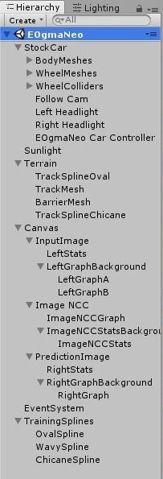
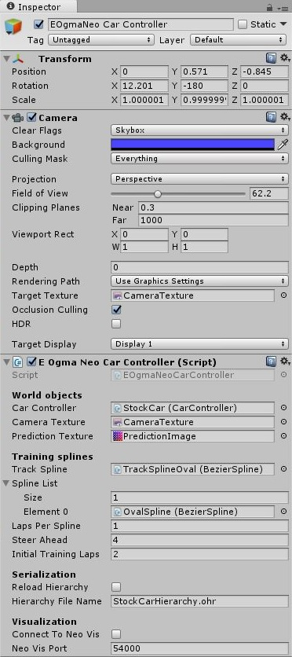

<!---
 OgmaDrive
 Copyright (c) 2017 Ogma Intelligent Systems Corp. All rights reserved.
--->

# OgmaDrive Developer Tutorial

[](https://gitter.im/ogmaneo/Lobby)

## Introduction

The [Unity](https://unity3d.com/) 3D Editor is required for modifying OgmaDrive. It is available for Mac OSX and Windows operating system.

After cloning/forking and pulling a local version of the repository, the initial Unity dialog box can be used to `OPEN` your local repository directory.

Three Unity scene files for OgmaDrive can be found in the `Assets` subdirectory. Using the `EOgmaNeo.unity` scene the following video shows OgmaDrive in action:

**NOTE:** Closed captions / subtitles provide an explanation during the following video.

<a href="https://www.youtube.com/embed/MpzHAjeRFhU?cc_load_policy=1" target="_blank"></a><div>https://www.youtube.com/watch?v=MpzHAjeRFhU?cc_load_policy=1

## Unity environment

|  |  |
|---|---|
| - The `Hierarchy` panel, shown on the right, is similar in both the `EOgmaNeo.unity` and `OgmaNeo.unity` scenes. Those scenes can be found in the project `Assets` directory. <div>- The `Stockcar` game object contains; body and wheel meshes, wheel collider objects, and all the car control C# scripts. The Stockcar game object itself uses the default Unity `CarController` scripts. <div>- The EOgmaNeo and OgmaNeo libraries are used in two C# scripts attached to the Stockcar object, namely `EOgmaNeo Car Controller` and `OgmaNeo Car Controller` game objects. <div>- The `Sunlight` is a distant point light source. Positioned to match the lighting baked into the sky box textures. <div>- The `Terrain` game object contains splines and objects that automatically generates the track and barrier meshes _when the simulation starts_. The `TrackMesh` object uses a `TrackGenerator.cs` script that is linked to a spline. The `BarrierMesh` object performs the same as the TrackMesh when constructing the barrier meshes, and uses the same spline used by the TrackMesh object. <div>- The `Canvas` contains all the 2D overlay information, such as the camera image display, graphs, and text. <div>- The `EventSystem` contains contains the `FPSDisplay.cs` script that handles the display of the top left frames per second (FPS) text, etc. <div>- The `TrainingSplines` are duplicated of the track spline and used to guide the Stockcar `CarController` scripts when driving around a track. |  |
| The `EOgmaNeo Car Controller` inspector panel contains all the public parameters exposed to the Editor by the `EOgmaNeoCarController.cs` script. This is identical to the `OgmaNeo Car Controller` inspector panel. <div>- With this being a child object of the `Stockcar` object, the `Camera` object here is position on the front-bumper of the Stockcar model and follows the position and orientation of the Stockcar. Every frame the image from this virtual camera is saved into the `CameraTexture`. The Field of View here is setup to match a Raspberry Pi camera module. <div>- The main `EOgmaNeoCarController.cs` script is found here, and has it's public parameters assigned to other game objects. <div>- The `World Objects` link the main Stockcar and it's `CarController.cs` script, allowing for obtaining of current steering angles and subsequent control of the steering, throttle, and braking inside the Unity `CarController.cs` scripts. The `CameraTexture` is also linked here, along with the resultant `PredictionImage` texture (so that it can be display on the `Canvas`). <div>- The splines used for automatically generating the track and barriers is linked here and used for training within the `EOgmaNeoCarController.cs` script. Additional splines can be used here to add further driving examples in the `Spline List` section. <div>- The EOgmaNeo (and OgmaNeo) network hierarchy can be saved and reloaded via the `Serialization` section. The `O` key is used to save a hierarchy during a simulation run. Reload of a hierarchy occurs when a simulation run starts. Bear in mind that it can take quite a few seconds to save a hierarchy to a file, and the simulation will pause/freeze until saving completes. <div>- The `Visualization` section (EOgmaNeo version only) allows it to connect to the [NeoVis](https://github.com/ogmacorp/NeoVis) visualizer for real-time viewing of hierarchy internals. NeoVis must be running and configured **before** starting a simulation run when this checkbox is ticked. |  |

<!---  --->

### Spline creation and editing

Splines are a simple way to generate alternative tracks, and consequently experiment with predictive hierarchies and their parameters.

Jasper Flick's [Catlike Coding](http://catlikecoding.com/unity/tutorials/) Unity C# scripts are used for handling spline creation and manipulation. He has a [tutorial](http://catlikecoding.com/unity/tutorials/curves-and-splines/) describing all the scripts used to create and edit splines. Splines that can then be used to automatically generate the track and barrier meshes. Mesh generation occurs during the _start up_ of a simulation run.

Adding a new spline requires the creation of a game object using the `Create Empty` GameObject menu options. In the Inspector panel for this new game object the `Add Component` button can then be used to add the `Scripts -> Bezier Spline` script.

The `Add Curve` button is used to append successive Bezier spline sections forming a [composite Bezier curve](https://en.wikipedia.org/wiki/Composite_B%C3%A9zier_curve). <span style="color:white">White</span>, <span style="color:cyan">Blue</span>, and <span style="color:yellow">Yellow</span> anchors allow for movement of control points. Control points can also be tagged with a continuity mode (curve derivative constraints). Typically this mode is set to `Aligned` for all control points.

The `Loop` toggle is used to form a closed loop of Bezier spline sections. The spline following code, used when training a car, looks ahead of it's current position to determine how to steer and maintain the car's momentum along the current spline it's following. Due to this a closed loop spline **must** be used for track mesh creation and subsequently for spline following by the car.

Once a closed loop spline is created, it can then be associated / attached to the `TrackMesh` game object's `Track Generator` script, and subsequently used as a training spline in the `EOgmaNeo Car Controller` game object and script.

Bear in mind that the `CarController` dynamics reacts to gravity. Care must be taken when creating a closed loop spline for use during training navigation and track/barrier mesh generation. The EOgmaNeo and OgmaNeo car controller scripts automatically place the stockcar object above the start of a Bezier spline. And waits for one second before any other code is allowed to run. This pause allows for gravity and the car dynamics/suspension effects to settle before starting to drive down the track.

## C# bindings

The [Unity](https://unity3d.com/) editor handles the building of all C# scripts used in the scenes. And through it's internal [Native Plugins](https://docs.unity3d.com/Manual/NativePlugins.html) system allows C++ shared library functionality to be used within C# scripts.

The [EOgmaNeo](https://github.com/ogmacorp/EOgmaNeo/tree/master/Cs) and [OgmaNeo](https://github.com/ogmacorp/OgmaNeo/tree/master/Cs) libraries both contain [SWIG](http://www.swig.org/) based builds that target C#. We can therefore create the appropriate shared libraries to include within a Unity project, and consequently access the EOgmaNeo and OgmaNeo C++/OpenCL hierarchies from within Unity C# scripts.

Within EOgmaNeo, we also link/package [SFML](https://www.sfml-dev.org/) and [OpenCV](http://opencv.org/) into the shared library. SFML is required for the [NeoVis](https://github.com/ogmacorp/NeoVis) hierarchy visualisation tool. OpenCV functionality is used for image processing, feature extraction, and sparse representation generation in EOgmaNeo pre-encoders.

Build and installation instructions for each library can be found here:

- EOgmaNeo: https://github.com/ogmacorp/OgmaNeo/tree/master/Cs
- OgmaNeo: https://github.com/ogmacorp/EOgmaNeo/tree/master/Cs

On Mac OS, for both EOgmaNeo and OgmaNeo, the `BUILD_BUNDLE` CMake variable is required to create a bundle file containing the shared library. For example:
> cmake -DBUILD_BUNDLE=ON ..

For EOgmaNeo the BUILD_PREENCODERS is required to include all the pre-encoders within that library. For example:
> cmake -DBUILD_BUNDLE=ON -DBUILD_PREENCODERS=ON ..

When building and updating EOgmaNeo, OpenCV **must** be included during the building process to tie in with it's use in a pre-encoder.

## EOgmaNeo OpenCV interop

EOgmaNeo optionally links to the OpenCV and SFML libraries, and provides the ability to call certain OpenCV functions, and a link via SFML to the NeoVis visualisation tool. The CMake build scripts automatically add the OpenCV and SFML support if it finds those packages installed on the system at build time.

The `EOgmaNeoCarController.cs` C# script contains examples of using OpenCV functions via the EOgmaNeo interop class. For example, processing images using a Gaussian blur and Sobel edge filter before use of a pre-encoder that generates the necessary network input sparse chunked representation.

## EOgmaNeo NeoVis connection

As mentioned above, the `EOgmaNeoCarController` inspector panel contains a `Visualization` section. If the `Connect to Neo Vis` checkbox is ticked, the script upon start up will try to connect to the NeoVis tool. **Note:** Make sure that NeoVis is running and configured before starting a simulation with this checkbox ticked.

## Updating EOgmaNeo / OgmaNeo

The output of the EOgmaNeo and OgmaNeo C# SWIG build is a shared library (or bundle) and a collection of C# scripts. Refer to the [EOgmaNeo Cs](https://github.com/ogmacorp/EOgmaNeo/tree/master/Cs) and [OgmaNeo Cs](https://github.com/ogmacorp/OgmaNeo/tree/master/Cs) Readme files for instructions on how to build these C# bindings and shared library. Both libraries require the 64-bit version to be built.

The output of the EOgmaNeo and OgmaNeo C# builds gets placed into an `(E)OgmaNeo\Cs\src\com\ogmacorp\(e)ogmaneo` subdirectory. All these files can then be placed within the OgmaDrive `Assets\Plugins\x86_64\EOgmaNeo` or `Assets\Plugins\x86_64\OgmaNeo` directories respectively. Mac OS bundle files should be placed into the `Assets\Plugins` directory.

## Experimenting with Predictive Hierarchies

The predictive hierarchies in OgmaNeo and EOgmaNeo are very similar. Variations occur due to implementation details within the encoders and decoders per layer, plus differing pre-encoder requirements.

### Pre-Encoders

The predictive hierarchies implemented inside EOgmaNeo and OgmaNeo, requires input data to be converted from a dense representation (such as an RGB image) to a sparse representation (such as a binary bit vector). It requires that pertinent spatial and consistent temporal features are encoded into the sparse representation. This is the job of a pre-encoder.

#### OgmaNeo pre-encoding

OgmaNeo handles densely represented spatiotemporal streaming data very well using an initial `SparseFeaturesType._distance` encoder/decoder layer followed by `SparseFeaturesType._chunk` layers. Therefore a minimum of processing occurs to data input into an OgmaNeo predictive hierarchy.

In the `OgmaNeoCarController.cs` script, that processing is currently RGB to Grey scale conversion (luminance extraction) followed by optional Gaussian blurring, and final convolution with a 3x3 Sobel filter. This filtered image along with the current steering angle is input to the hierarchy every frame. The OgmaNeo predictive hierarchy then outputs what it predicts an image and steering angle it thinks it will be shown next.

In the `OgmaNeo.unity` scene the predicted next image the hierarchy expects to see is shown on the right hand side. This predicted image is compared with the next pre-encoded (Sobel filtered luminance image) using a [normalized cross correlation](https://en.wikipedia.org/wiki/Cross-correlation#Normalized_cross-correlation) (NCC) to estimate the confidence that the hierarchy has per frame when predicting an appropriate steering angle.

A NCC value above 85% stops the spline following and learning within the hierarchy, forcing the car to _only_ use predicted steering angles from the hierarchy to drive around the track. If the NCC value drops below 25% (lower hierarchy confidence) the car swaps back to spline following and learning within the hierarchy is reenabled.

#### EOgmaNeo pre-encoding

EOgmaNeo requires input data in a form we refer to as a Sparse Chunked Representation. The EOgmaNeo [Readme.md](https://github.com/ogmacorp/EOgmaNeo/tree/master/Readme.md) and [Tutorial.md](https://github.com/ogmacorp/EOgmaNeo/tree/master/Tutorial.md) files provide an introduction to this form of representation.

Creation of this sparse representation from camera image data, evolved from using edge detection methods and subsequent extraction of a sparse representation of the edge features detection, to the final use of OpenCV's [Line Segment Detector](http://docs.opencv.org/3.0-beta/modules/line_descriptor/doc/LSDDetector.html). This detector finds temporally consistent line segments within consecutive images, followed by our addition of the 'chunking' of the line segments detected to create a 1D sparse vector for input into an EOgmaNeo hierarchy. This pre-encoder implementation can be found in the EOgmaNeo [OpenCVInterop.cpp](https://github.com/ogmacorp/EOgmaNeo/blob/master/source/optional/OpenCVInterop.cpp#L99-L195) file.

In the `EOgmaNeo.unity` scene this is shown on the right as a half-height image of the output of the OpenCV Line Segment Detector, with line segments found drawn over it. Below that is the sparse chunked representation of those line segments, and below that is the predicted sparse representation output from the hierarchy.

The input and output sparse representations from the hierarchy is compared across a sequence of consecutive frames (controlled by the private `_maxNumStates` class parameter, defaults to 15 frames). Similar to the OgmaNeo car controller script, this comparison across frames of input versus predicted sparse representation forms the confidence metric used and displayed (NCC value and graph).

In the same way as the OgmaNeo Car Controller, the NCC value is used to swap between hierarchy learning and spline following, and automatic driving based only on the hierarchies predicted steering angle.

### OgmaNeo hierarchies

After input layers have been added to a hierarchy `Architect`, higher layers are added. For example, in `OgmaNeoCarController.cs`:

```csharp
        // Add Y' input layer (typically 64x64)
        arch.addInputLayer(new Vec2i(_inputWidth, _inputHeight));

        // Add scalar values input layer (steering angle)
        arch.addInputLayer(new Vec2i(1, 1));

        arch.addHigherLayer(new Vec2i(96, 96), SparseFeaturesType._distance);
        arch.addHigherLayer(new Vec2i(96, 96), SparseFeaturesType._chunk);
        arch.addHigherLayer(new Vec2i(96, 96), SparseFeaturesType._chunk);
        arch.addHigherLayer(new Vec2i(96, 96), SparseFeaturesType._chunk);
        arch.addHigherLayer(new Vec2i(60, 60), SparseFeaturesType._chunk);
        arch.addHigherLayer(new Vec2i(60, 60), SparseFeaturesType._chunk);
```

The size of the higher layers can be modified here. In the above case the size is 96 by 96, with higher layers being 60 x 60. The input layers being a 64x64 post-processed image and a 1x1 steering angle.

Typically the first higher layer is always a `_distance` type, with further layers being a `_chunk` type.

Modifying internal encoder/decoder layer parameters can be done by setting up `ParameterModifier` entries returned by the `addHigherLayer` functions. For example,

```csharp
        ParameterModifier layerParams = arch.addHigherLayer(new Vec2i(96, 96), SparseFeaturesType._chunk);
        layerParams.setValue("p_alpha", 0.08f);
        layerParams.setValue("p_beta", 0.16f);
```

In the above example, the layer's forward prediction learning rate (p_alpha) is smaller than the feedback learning rate (p_beta).

Refer to the OgmaNeo Readme's Parameters section for details of what layer parameters can be modified: https://github.com/ogmacorp/OgmaNeo#parameters

### EOgmaNeo hierarchies

The embedded and event based version of OgmaNeo inside EOgmaNeo sparse predictive hierarchies, requires smaller and fewer encoder/decoder layers for learning how to drive around the oval track.

The following example, taken from `EOgmaNeoCarController.cs` shows layer construction and parameter setup:

```csharp
        // Hierarchy layer descriptions
        const int layerSize = 36;
        const int numLayers = 3;

        StdVecLayerDesc lds = new StdVecLayerDesc(numLayers);

        for (int l = 0; l < numLayers; l++)
        {
            lds.Add(new LayerDesc());
            lds[l]._width = layerSize;
            lds[l]._height = layerSize;
            lds[l]._chunkSize = 6;
            lds[l]._forwardRadius = 9;
            lds[l]._backwardRadius = 9;
            lds[l]._ticksPerUpdate = 2;
            lds[l]._temporalHorizon = 2;
            lds[l]._alpha = 0.065f;
            lds[l]._beta = 0.1f;

            // Disable reinforcement learning
            lds[l]._delta = 0.0f;
        }
```

As stated before, the sparse predictive hierarchies inside EOgmaNeo requires the input data to be pre-encoded into a specific format known as a sparse chunked representations. Changing EOgmaNeo layer sizes therefore requires matching changes in the pre-encoder output sizes.

The EOgmaNeo [Tutorial.md](https://github.com/ogmacorp/EOgmaNeo/blob/master/TUTORIAL.md) provides an overview and example of the setup required with a pre-encoder and hierarchy: https://github.com/ogmacorp/EOgmaNeo/blob/master/TUTORIAL.md

EOgmaNeo hierarchies make use of one type of sparse predictors. Therefore their construction is simpler. Although they also inherit parameters of a similar nature to their OgmaNeo counterparts. For example, an EOgmaNeo layer `_alpha` parameter equates to an OgmaNeo `p_alpha` layer parameter.

## Contributions

Refer to the [CONTRIBUTING.md](https://github.com/ogmacorp/OgmaDrive/blob/master/CONTRIBUTING.md) file for information on making contributions to OgmaDrive.

## License and Copyright

<a rel="license" href="http://creativecommons.org/licenses/by-nc-sa/4.0/"></a><br />The work in this repository is licensed under the <a rel="license" href="http://creativecommons.org/licenses/by-nc-sa/4.0/">Creative Commons Attribution-NonCommercial-ShareAlike 4.0 International License</a>.See the  [OGMADRIVE_LICENSE.md](https://github.com/ogmacorp/OgmaDrive/blob/master/OGMADRIVE_LICENSE.md) and [LICENSE.md](https://github.com/ogmacorp/OgmaDrive/blob/master/LICENSE.md) file for further information.

Contact Ogma via licenses@ogmacorp.com to discuss commercial use and licensing options.

Jasper Flick's [Catlike Coding](http://catlikecoding.com/unity/tutorials/) Unity C# scripts are used for handling spline creation and manipulation.

OgmaDrive Copyright (c) 2017 [Ogma Intelligent Systems Corp](https://ogmacorp.com). All rights reserved.
